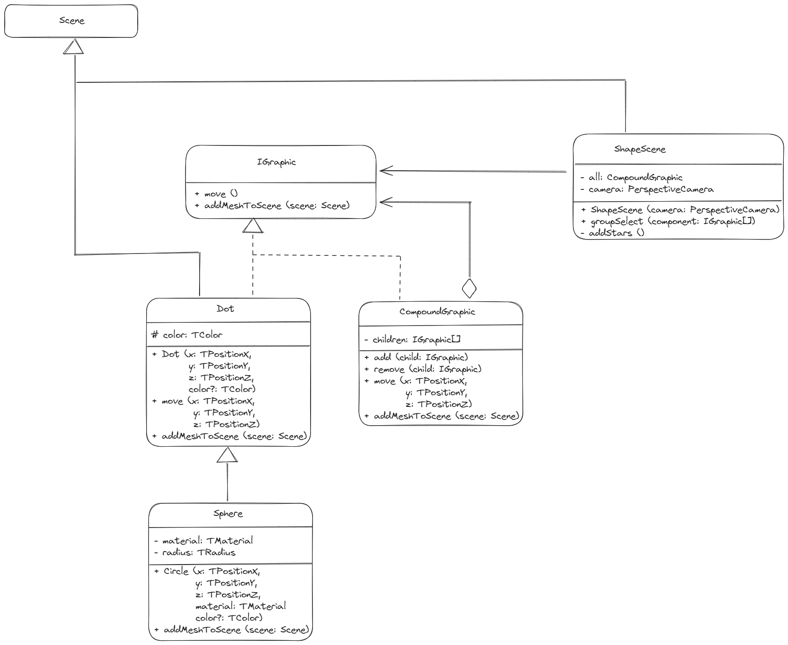

# PLANET
Render Stars/Planet... with Vite, Typescript and Threejs

In this example, Sun and Planets (also satellite) are considered as `Sphere` and stars are `Dot`.

## UML

The `CompoundGraphic` contains several kind of shapes : could be `Dot` or `Sphere` or even `CompositionGraphic`.
A `composite pattern` have been implemented to separate responsabilities: The class `ShapeScene` can manipulate different kind of shapes through the interface `IGraphic` without been coupled to the complexe structures and independently to the complexity of the object.
We can assimilate  the `leaf` of the pattern to the class `Dot` and the `composite` of the pattern to the class `CompoundGraphic`.

Inspiration came from [`refactoring guru`](https://refactoring.guru/design-patterns/composite/typescript/example)
